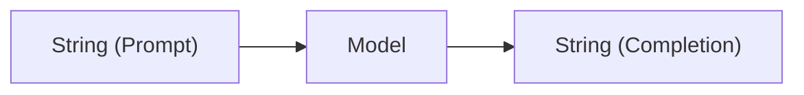
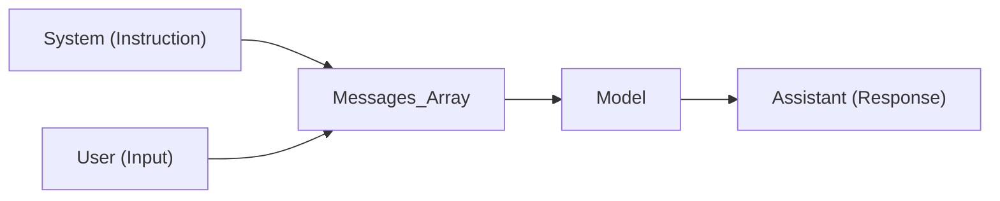
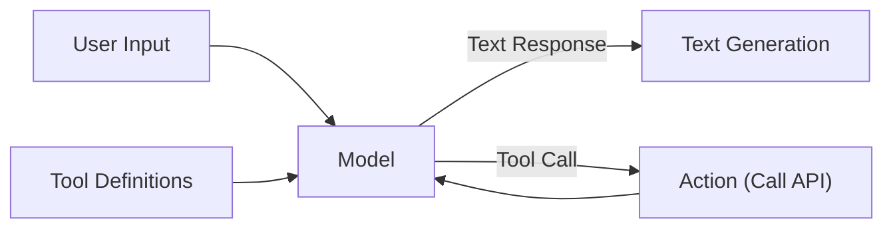
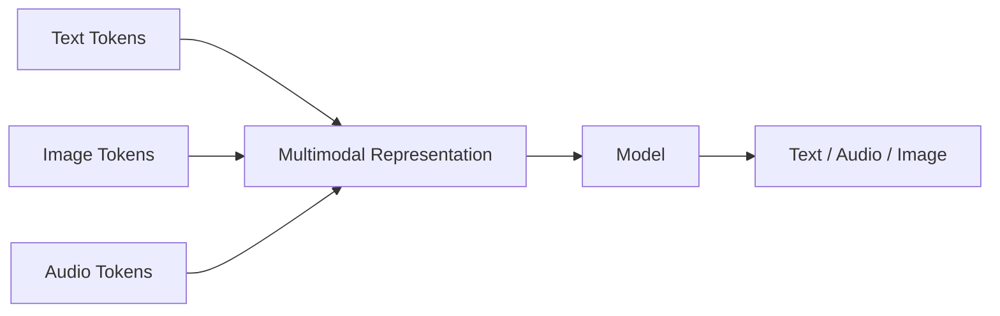
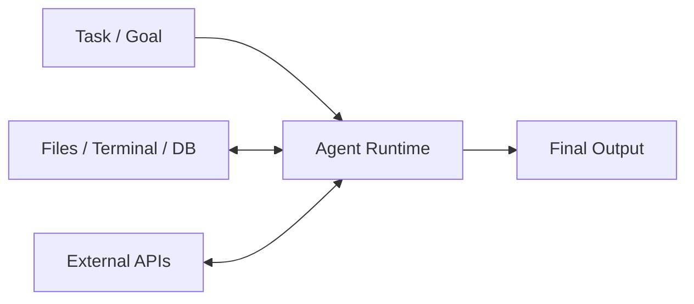

# API 是 AI 能力最真实的镜子


## 前言

> **过去五年，大模型真正发生变化的，不只是参数规模和打榜跑分，更重要的是它在软件系统中的角色发生了根本性转变：它从一个单纯的文本生成函数（Text Generator），逐步演化为一个能够理解上下文、调用外部工具、执行复杂任务的运行时（Runtime）。而 API，正是这一演化过程最真实、最直观的镜子。**


如果把过去五年的 AI API 摆在一起看，你会发现一个很有意思的现象。

2020 年的 GPT-3 API，结构极其简单，大概只有零星几个参数：

```json
{
  "prompt": "...",
  "temperature": 0.7
}
```

而今天，无论是 OpenAI 的 Responses API、Claude 的 Messages API，还是 Gemini API，一个完整的请求 Payload 里面已经塞满了各种对象：`messages`, `tools`, `reasoning`, `modalities`, `response_format`, `computer`, `search`, `memory`...

API 似乎变得越来越臃肿复杂了。很多开发者可能会抱怨：**API 的设计越来越“重”了。**

但如果换一个软件工程的视角来看，这种“臃肿”其实有迹可循：**重要的 API 变化，往往对应着模型能力边界的扩展，或者能力工程化方式的演进。**

与其盯着模型排行榜上那零点几个百分点的指标提升，不如沿着 API 的演进路线，重新理解过去五年 AI 究竟发生了怎样的蜕变。

> **本文讨论的是开发者视角下的 API 演进，而不是模型架构或训练技术的发展史。为了突出主要脉络，文中会适当简化部分实现细节。**

---

## 第一阶段：Completion API —— AI 只是一个文本生成器


**示例请求 (Sample Payload):**
```json
{
  "prompt": "The following is a conversation with an AI assistant. The assistant is helpful, creative, clever, and very friendly.\n\nHuman: Hello, who are you?\nAI: I am an AI created by OpenAI. How can I help you today?\nHuman: I'd like to cancel my subscription.\nAI:"
}
```

**架构示意:**


这一代的模型，本质上只会做一件事：**续写（Next Token Prediction）**。

因此，它的 API 签名极其纯粹：`String -> String`。

此时的模型是没有“世界观”的。它不知道谁在说话，谁是系统，更不懂什么叫“历史上下文”。模型在训练阶段没有被显式区分角色，一切逻辑都依赖开发者用纯文本的 Prompt 去硬拼凑。

于是，业界诞生了一门玄学——Prompt Engineering（提示词工程）。


事实上，今天我们在用的很多复杂的 System Prompt，本质上都是那个时代“硬编码”留下的遗产。**这一代 API 的设计，对应了那一代模型最原始的能力底色。**

---

## 第二阶段：Chat API —— 模型开始理解“对话与角色”


**示例请求 (Sample Payload):**
```json
{
  "messages": [
    {"role": "system", "content": "You are a helpful assistant."},
    {"role": "user", "content": "Hello!"}
  ]
}
```

**架构示意:**


Completion API 最大的问题，并不是模型不会聊天，而是**所有上下文都只能编码在一个字符串里**。

Chat API 的价值，不是把 `prompt` 改成了 `messages`，而是把原本隐含在 Prompt 中的语义（系统指令、用户输入、历史对话）显式建模为带类型标签的数据结构。

对开发者而言，这意味着 Prompt 从一段自由文本变成了一个具有 Schema 的消息序列；对模型而言，则意味着训练和推理阶段都可以利用这些结构化标签。

### API 的变化，不一定意味着模型架构发生变化

这里需要区分三个层次：

* 模型架构（Transformer 等）
* 模型训练方式（Instruction Tuning、RLHF 等）
* API 协议设计（Messages、Tools 等）

很多 API 的变化，并不是 Transformer 的变化，而是模型训练方式和工程接口共同演进的结果。

因此，这篇文章讨论的是**开发者看到的 AI 能力边界**，而不是模型内部实现。

---

## 第三阶段：Tool Calling —— 模型第一次拥有行动能力


**示例请求 (Sample Payload):**
```json
{
  "messages": [{"role": "user", "content": "What's the weather like in Boston?"}],
  "tools": [{
    "type": "function",
    "function": {
      "name": "get_current_weather",
      "description": "Get the current weather in a given location"
    }
  }],
  "tool_choice": "auto"
}
// Response:
{
  "tool_calls": [{
    "id": "call_abc123",
    "type": "function",
    "function": { "name": "get_current_weather", "arguments": "{\"location\": \"Boston, MA\"}" }
  }]
}
```

**架构示意:**


Tool Calling 最大的变化，并不是“模型可以调用天气 API”。

而是 API 第一次允许模型把“回答”和“行动”分离。

在 Completion API 中，模型唯一的输出是文本；而在 Tool Calling 中，模型可以输出一种新的中间结果——“请替我执行这个动作”。

从软件系统的角度来看，这意味着模型开始参与控制流（Control Flow），而不仅仅是数据生成（Data Generation）。智能从单纯的回答者，走向了动态的执行者。

---

## 第四阶段：Multimodal —— 统一世界模型（Unified Representation）


**示例请求 (Sample Payload):**
```json
{
  "messages": [
    {
      "role": "user",
      "content": [
        {"type": "text", "text": "What’s in this image?"},
        {
          "type": "image_url",
          "image_url": { "url": "https://upload.wikimedia.org/..." }
        }
      ]
    }
  ]
}
```

**架构示意:**


以前的输入是单纯的 `Text`，后来变成了 `Content[]` 数组，可以包含 `Text`, `Image`, `Audio`, `Video`, `PDF`。

为什么 API 会这样演进？因为在最前沿的模型眼中，图片、声音已经不再是需要 OCR 或 ASR 预处理的“特殊输入”，它们与文字一样，都只是 Token。

API 中 `modalities` 的增加，本质上映射的是：**模型开始拥有统一的信息表示能力（Unified Representation）。** 这是多模态真正的关键之处——它不是在“支持图片”，而是在底层“统一世界”。

---

## 第五阶段：Agent Runtime —— API 开始描述执行过程与环境


**示例响应 (Sample Response):**
```json
{
  "output": [
    {
      "type": "message",
      "role": "assistant",
      "content": "Let me search the web for that."
    },
    {
      "type": "tool_call",
      "name": "web_search",
      "arguments": "{\"query\": \"latest AI news\"}"
    }
  ]
}
```

**架构示意:**


这是当下正在发生的、最大的软件范式变革。

回顾前几个阶段，API 无论怎么变，返回的终究是一个“结果（Answer）”。
但今天，比如你看 OpenAI 的 Responses API 或者最新的实时流式 API，它们返回的是 `Tool Call`, `Reasoning`, `Events`, `State`, `Output`。

API 不再只返回结果，而是开始**输出整个工作流（Workflow）**。

为什么很多开发者觉得现在的 Agent SDK 越来越庞大难懂？其实不是 SDK 复杂了，而是**模型承担的软件职责越来越多了。模型越来越不像一个函数，而越来越像一个 Runtime。** 

这就不得不提到当下快速兴起的 **MCP (Model Context Protocol)**。随着模型越来越依赖外部工具，行业开始探索统一的工具协议。MCP 是目前影响力最大的尝试之一，但它并不是唯一方案，也未必会是最终方案。当模型成为运行时，它不仅需要工具，还需要一个标准协议来挂载和感知本地环境（文件、数据库、终端）。API 不得不去描述整个执行过程和上下文状态，因为模型正在接管原属于代码的控制流。

---

## 一个软件工程视角的总结

如果把这五年的演进画一条线，你会发现一个清晰的轨迹：

| 时间      | 事件                                               |
| ------- | ------------------------------------------------ |
| 2020    | Completion API                                   |
| 2023.03 | Chat Completions                                 |
| 2023.06 | Function Calling                                 |
| 2023.09 | 多模态统一输入（Content）逐渐成熟                             |
| 2025~   | Responses API、Agent Runtime、Computer Use 等能力逐渐收敛 |

API 每升级一次，模型就向“真正的程序”迈进一步。

* **以前**：程序负责控制流程，模型只负责生成文本。
* **今天**：模型负责控制流程，程序退化为只负责执行具体的原子动作。


过去五年，API 其实一直在暗中做一件事：**不断把原来属于程序的职责，无缝迁移到模型中。** 我们可以看看这张对照表：

| 原来属于传统程序的职责 | 今天属于大模型的职责 |
| :--- | :--- |
| Prompt 纯文本拼接 | Context 窗口与状态管理 |
| 历史记录状态维护 | Conversation / Message Sequence |
| 业务分支 (If-Else) 判断 | Tool Choice 动态路由 |
| RPC 接口调用封装 | Function Calling 原生支持 |
| 复杂工作流编排 | Agent Planning (Reasoning) |
| 正则提取 / JSON 转换 | Structured Output 结构化输出 |
| 独立的多媒体解析模块 | Multimodal Understanding 统一模态 |

这就是过去几年 AI API 演进真正的主线。由于模型接管了繁琐的逻辑控制流，开发者才得以从无穷尽的 If-else 中解脱出来，专注于定义目标 (Goal) 和提供上下文 (Context)，剩下的事情，交由模型这个 Runtime 自动执行。

---

## 未来还会怎样？预测 API 的下一步

因为 API 的设计永远滞后于模型能力的突破一点点，所以通过现在的瓶颈，我们大概能猜到 API 的下一步。


我认为未来三年，最核心的变化将是从 **命令式 (Imperative)** 走向 **声明式 (Declarative)**。

API 的核心负载将不再是微观的 `messages`，而会变成宏观的声明：
```yaml
Task: "帮我重构这段遗留代码"
Goal: "提升性能并补充单元测试"
Capability: [Code_Execution, Web_Search]
Memory: [Project_History]
Environment: [Local_Workspace]
```

未来我们调用的入口，可能不再是带着对话历史的 `chat()`，而是一个更具宏观执行力的 `execute(task)`。

因为，大模型的职责，已经从“回答问题”，转向了“完成任务”。
